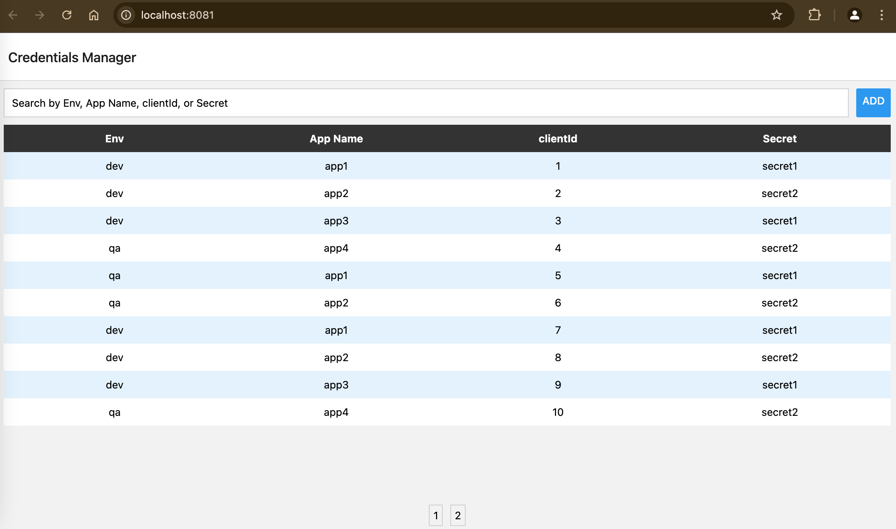

# Cred Manager

Cred Manager is a simple credential management tool that allows users to securely store and manage their credentials.

## Features

- Securely store credentials
- Easy to use interface
- Encryption for stored credentials

## Installation

To install Cred Manager, clone the repository and install the dependencies:

```bash
git clone https://github.com/yourusername/cred-manager.git
cd cred-manager
npm install
```

## Usage

To start the application, run:

```bash
npx expo start
```
## Screenshot

Here is a screenshot of the running application:


## Contributing

Contributions are welcome! Please fork the repository and submit a pull request.

## License

This project is licensed under the MIT License.